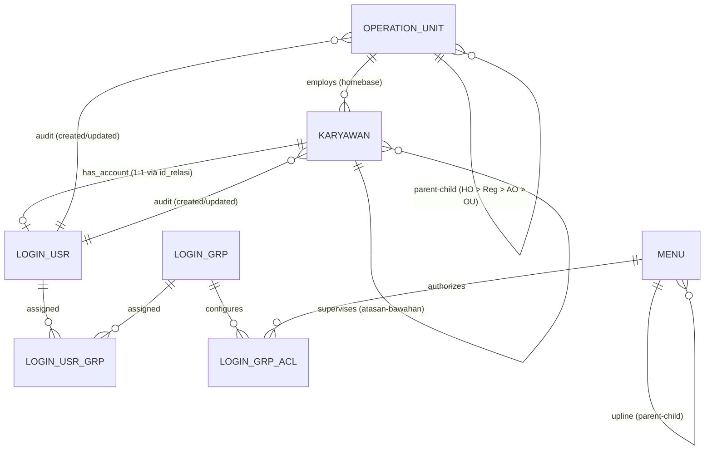

# Dokumentasi Teknis Backend: Unified Operation Unit & Master Karyawan
**Framework Backend Platform v1 (Clean Architecture & Hierarchical Data Scoping)**

Dokumen ini adalah panduan teknis implementasi backend dari layer **Database (DDL/Prisma)**, **Domain & Entities**, **Application Use Cases**, hingga **Presentation (Controllers, Routes & OpenAPI Endpoints)** sebelum integrasi ke frontend.

---

## 📑 Daftar Isi
1. [Arsitektur Bisnis & Relasi Entitas](#1-arsitektur-bisnis--relasi-entitas)
2. [Hierarchical Data Scoping (Unified Organization Tree)](#2-hierarchical-data-scoping-unified-organization-tree)
3. [Perancangan Basis Data (Database Schema & DDL)](#3-perancangan-basis-data-database-schema--ddl)
4. [Struktur Folder & Clean Architecture](#4-struktur-folder--clean-architecture)
5. [Spesifikasi Domain & Repository Interface](#5-spesifikasi-domain--repository-interface)
6. [Spesifikasi Use Cases (Application Layer)](#6-spesifikasi-use-cases-application-layer)
7. [Spesifikasi API Endpoints & Request/Response (Presentation Layer)](#7-spesifikasi-api-endpoints--requestresponse-presentation-layer)
8. [Matriks Konstanta Menu & Registrasi](#8-matriks-konstanta-menu--registrasi)
9. [Checklist Tahapan Eksekusi Backend](#9-checklist-tahapan-eksekusi-backend)

---

## 1. Arsitektur Bisnis & Relasi Entitas

Sistem ini memisahkan otorisasi menjadi dua pilar:
1. **Otorisasi Fungsional (Feature/Menu ACL):** Dikelola oleh **Role Management (`login_grp`)** yang memetakan izin menu (Create, Read, Update, Delete).
2. **Otorisasi Data (Spatial/Organizational Scope):** Dikelola oleh **Unified Organization Tree (`operation_unit`)** di mana setiap user terikat pada satu homebase kantor/unit melalui data **Karyawan**.



---

## 2. Hierarchical Data Scoping (Unified Organization Tree)

Seluruh tingkatan unit organisasi (Head Office, Regional, Area Office, Cabang/Gudang) berada dalam **satu tabel pohon (`operation_unit`)** dengan kolom `parent_id` dan `type`:

| Level | `type` | `parent_id` | Cakupan Visibilitas Data |
|---|---|---|---|
| **Head Office** | `HEAD_OFFICE` | `NULL` | **Global (Seluruh Nasional)** — Dapat melihat seluruh transaksi dan unit. |
| **Regional** | `REGIONAL` | ID Head Office | **Regional Scope** — Dapat melihat seluruh Area Office dan Operation Unit di bawah region tersebut. |
| **Area Office** | `AREA_OFFICE` | ID Regional | **Area Scope** — Dapat melihat seluruh Operation Unit yang menginduk ke area tersebut. |
| **Operation Unit** | `OPERATION_UNIT` | ID Area Office | **Unit Scope (Isolasi Ketat)** — Hanya dapat melihat data operasional unitnya sendiri. |

### Mekanisme Recursive Query (PostgreSQL CTE)
Untuk mendapatkan seluruh `allowed_unit_ids` yang bisa diakses oleh suatu unit:
```sql
WITH RECURSIVE unit_hierarchy AS (
    SELECT id, parent_id, name, type FROM operation_unit WHERE id = :user_unit_id
    UNION ALL
    SELECT ou.id, ou.parent_id, ou.name, ou.type
    FROM operation_unit ou
    INNER JOIN unit_hierarchy uh ON ou.parent_id = uh.id
)
SELECT id FROM unit_hierarchy;
```

---

## 3. Perancangan Basis Data (Database Schema & DDL)

### A. DDL PostgreSQL Murni ([schema_postgres.sql](file:///Users/dyra/Documents/Docker/framework-app/auth-platform-backend/doc/schema_postgres.sql))

```sql
-- =====================================================================
-- 1. TABEL: operation_unit (Unified Organization Tree)
-- =====================================================================
CREATE TABLE operation_unit (
    id UUID PRIMARY KEY DEFAULT gen_random_uuid(),
    parent_id UUID NULL,
    code VARCHAR(50) NOT NULL UNIQUE,
    name VARCHAR(150) NOT NULL,
    type VARCHAR(50) NOT NULL, -- 'HEAD_OFFICE', 'REGIONAL', 'AREA_OFFICE', 'OPERATION_UNIT'
    category VARCHAR(50) NULL, -- 'Cabang', 'Gudang', 'Depo', 'Hub', dll
    distribution_point VARCHAR(100) NULL,
    address TEXT NULL,
    province_id UUID NULL,
    city_id UUID NULL,
    district_id UUID NULL,
    village_id UUID NULL,
    postal_code VARCHAR(10) NULL,
    phone VARCHAR(30) NULL,
    latitude DECIMAL(10, 8) NULL,
    longitude DECIMAL(11, 8) NULL,
    building_status VARCHAR(30) NULL,
    lease_category VARCHAR(30) NULL,
    lease_start_date DATE NULL,
    lease_end_date DATE NULL,
    annual_rent DECIMAL(15, 2) NULL,
    legal_document_type VARCHAR(50) NULL,
    legal_document_number VARCHAR(100) NULL,
    status BOOLEAN NOT NULL DEFAULT TRUE,
    created_at TIMESTAMP(3) NOT NULL DEFAULT CURRENT_TIMESTAMP,
    created_by UUID NULL,
    updated_at TIMESTAMP(3) NOT NULL DEFAULT CURRENT_TIMESTAMP,
    updated_by UUID NULL,
    CONSTRAINT fk_ou_parent FOREIGN KEY (parent_id) 
        REFERENCES operation_unit(id) ON DELETE RESTRICT ON UPDATE CASCADE,
    CONSTRAINT fk_ou_created_by FOREIGN KEY (created_by) 
        REFERENCES login_usr(id) ON DELETE SET NULL,
    CONSTRAINT fk_ou_updated_by FOREIGN KEY (updated_by) 
        REFERENCES login_usr(id) ON DELETE SET NULL
);

CREATE INDEX idx_ou_parent ON operation_unit (parent_id);
CREATE INDEX idx_ou_type ON operation_unit (type);
CREATE INDEX idx_ou_code ON operation_unit (code);
CREATE INDEX idx_ou_status ON operation_unit (status);

-- =====================================================================
-- 2. TABEL: karyawan (Master Karyawan 32 Kolom)
-- =====================================================================
CREATE TABLE karyawan (
    id UUID PRIMARY KEY DEFAULT gen_random_uuid(),
    operation_unit_id UUID NOT NULL,
    division_id UUID NULL,
    supervisor_id UUID NULL,
    employee_number VARCHAR(50) NOT NULL UNIQUE,
    nik VARCHAR(20) NOT NULL UNIQUE,
    legal_name VARCHAR(150) NOT NULL,
    email VARCHAR(100) NULL UNIQUE,
    phone VARCHAR(30) NULL,
    sex VARCHAR(20) NULL,
    marital_status VARCHAR(30) NULL,
    religion VARCHAR(30) NULL,
    place_of_birth VARCHAR(100) NULL,
    date_of_birth DATE NULL,
    last_education VARCHAR(50) NULL,
    address TEXT NULL,
    province_id UUID NULL,
    city_id UUID NULL,
    district_id UUID NULL,
    village_id UUID NULL,
    postal_code VARCHAR(10) NULL,
    original_date_of_hire DATE NULL,
    permanent_date DATE NULL,
    actual_termination_date DATE NULL,
    bank_id UUID NULL,
    account_name VARCHAR(100) NULL,
    account_number VARCHAR(50) NULL,
    status BOOLEAN NOT NULL DEFAULT TRUE,
    created_at TIMESTAMP(3) NOT NULL DEFAULT CURRENT_TIMESTAMP,
    created_by UUID NULL,
    updated_at TIMESTAMP(3) NOT NULL DEFAULT CURRENT_TIMESTAMP,
    updated_by UUID NULL,
    CONSTRAINT fk_karyawan_ou FOREIGN KEY (operation_unit_id) 
        REFERENCES operation_unit(id) ON DELETE RESTRICT ON UPDATE CASCADE,
    CONSTRAINT fk_karyawan_supervisor FOREIGN KEY (supervisor_id) 
        REFERENCES karyawan(id) ON DELETE SET NULL ON UPDATE CASCADE,
    CONSTRAINT fk_karyawan_created_by FOREIGN KEY (created_by) 
        REFERENCES login_usr(id) ON DELETE SET NULL,
    CONSTRAINT fk_karyawan_updated_by FOREIGN KEY (updated_by) 
        REFERENCES login_usr(id) ON DELETE SET NULL
);

CREATE INDEX idx_karyawan_ou ON karyawan (operation_unit_id);
CREATE INDEX idx_karyawan_supervisor ON karyawan (supervisor_id);
CREATE INDEX idx_karyawan_nik ON karyawan (nik);
CREATE INDEX idx_karyawan_employee_number ON karyawan (employee_number);
CREATE INDEX idx_karyawan_status ON karyawan (status);

-- =====================================================================
-- 3. UPDATE: login_usr (Relasi 1:1 ke Karyawan via id_relasi)
-- =====================================================================
ALTER TABLE login_usr 
    ADD CONSTRAINT uq_login_usr_id_relasi UNIQUE (id_relasi);

ALTER TABLE login_usr 
    ADD CONSTRAINT fk_login_usr_karyawan FOREIGN KEY (id_relasi) 
        REFERENCES karyawan(id) ON DELETE CASCADE ON UPDATE CASCADE;
```

---

### B. Prisma Schema ([schema.prisma](file:///Users/dyra/Documents/Docker/framework-app/auth-platform-backend/prisma/schema.prisma))

```prisma
datasource db {
  provider = "postgresql"
  url      = env("DATABASE_URL")
}

generator client {
  provider = "prisma-client-js"
}

model OperationUnit {
  id                  String          @id @default(uuid()) @db.Uuid
  parentId            String?         @map("parent_id") @db.Uuid
  code                String          @unique @db.VarChar(50)
  name                String          @db.VarChar(150)
  type                String          @db.VarChar(50) // 'HEAD_OFFICE' | 'REGIONAL' | 'AREA_OFFICE' | 'OPERATION_UNIT'
  category            String?         @db.VarChar(50)
  distributionPoint   String?         @map("distribution_point") @db.VarChar(100)
  address             String?         @db.Text
  provinceId          String?         @map("province_id") @db.Uuid
  cityId              String?         @map("city_id") @db.Uuid
  districtId          String?         @map("district_id") @db.Uuid
  villageId           String?         @map("village_id") @db.Uuid
  postalCode          String?         @map("postal_code") @db.VarChar(10)
  phone               String?         @db.VarChar(30)
  latitude            Decimal?        @db.Decimal(10, 8)
  longitude           Decimal?        @db.Decimal(11, 8)
  buildingStatus      String?         @map("building_status") @db.VarChar(30)
  leaseCategory       String?         @map("lease_category") @db.VarChar(30)
  leaseStartDate      DateTime?       @map("lease_start_date") @db.Date
  leaseEndDate        DateTime?       @map("lease_end_date") @db.Date
  annualRent          Decimal?        @map("annual_rent") @db.Decimal(15, 2)
  legalDocumentType   String?         @map("legal_document_type") @db.VarChar(50)
  legalDocumentNumber String?         @map("legal_document_number") @db.VarChar(100)
  status              Boolean         @default(true)
  createdAt           DateTime        @default(now()) @map("created_at") @db.Timestamp(3)
  createdBy           String?         @map("created_by") @db.Uuid
  updatedAt           DateTime        @updatedAt @map("updated_at") @db.Timestamp(3)
  updatedBy           String?         @map("updated_by") @db.Uuid

  parent              OperationUnit?  @relation("UnitTree", fields: [parentId], references: [id], onDelete: Restrict)
  children            OperationUnit[] @relation("UnitTree")
  karyawans           Karyawan[]
  creator             LoginUsr?       @relation("OUCreator", fields: [createdBy], references: [id], onDelete: SetNull)
  updater             LoginUsr?       @relation("OUUpdater", fields: [updatedBy], references: [id], onDelete: SetNull)

  @@map("operation_unit")
}

model Karyawan {
  id                    String         @id @default(uuid()) @db.Uuid
  operationUnitId       String         @map("operation_unit_id") @db.Uuid
  divisionId            String?        @map("division_id") @db.Uuid
  supervisorId          String?        @map("supervisor_id") @db.Uuid
  employeeNumber        String         @unique @map("employee_number") @db.VarChar(50)
  nik                   String         @unique @db.VarChar(20)
  legalName             String         @map("legal_name") @db.VarChar(150)
  email                 String?        @unique @db.VarChar(100)
  phone                 String?        @db.VarChar(30)
  sex                   String?        @db.VarChar(20)
  maritalStatus         String?        @map("marital_status") @db.VarChar(30)
  religion              String?        @db.VarChar(30)
  placeOfBirth          String?        @map("place_of_birth") @db.VarChar(100)
  dateOfBirth           DateTime?      @map("date_of_birth") @db.Date
  lastEducation         String?        @map("last_education") @db.VarChar(50)
  address               String?        @db.Text
  provinceId            String?        @map("province_id") @db.Uuid
  cityId                String?        @map("city_id") @db.Uuid
  districtId            String?        @map("district_id") @db.Uuid
  villageId             String?        @map("village_id") @db.Uuid
  postalCode            String?        @map("postal_code") @db.VarChar(10)
  originalDateOfHire    DateTime?      @map("original_date_of_hire") @db.Date
  permanentDate         DateTime?      @map("permanent_date") @db.Date
  actualTerminationDate DateTime?      @map("actual_termination_date") @db.Date
  bankId                String?        @map("bank_id") @db.Uuid
  accountName           String?        @map("account_name") @db.VarChar(100)
  accountNumber         String?        @map("account_number") @db.VarChar(50)
  status                Boolean        @default(true)
  createdAt             DateTime       @default(now()) @map("created_at") @db.Timestamp(3)
  createdBy             String?        @map("created_by") @db.Uuid
  updatedAt             DateTime       @updatedAt @map("updated_at") @db.Timestamp(3)
  updatedBy             String?        @map("updated_by") @db.Uuid

  operationUnit         OperationUnit  @relation(fields: [operationUnitId], references: [id], onDelete: Restrict)
  supervisor            Karyawan?      @relation("SupervisorTree", fields: [supervisorId], references: [id], onDelete: SetNull)
  subordinates          Karyawan[]     @relation("SupervisorTree")
  userAccount           LoginUsr?      @relation("KaryawanAccount")
  creator               LoginUsr?      @relation("KaryawanCreator", fields: [createdBy], references: [id], onDelete: SetNull)
  updater               LoginUsr?      @relation("KaryawanUpdater", fields: [updatedBy], references: [id], onDelete: SetNull)

  @@map("karyawan")
}

model LoginUsr {
  id               String          @id @default(uuid()) @db.Uuid
  username         String          @unique @db.VarChar(50)
  passwd           String          @db.VarChar(100)
  aktif            Int             @default(1) @db.SmallInt
  tgl1             DateTime        @map("tgl_1") @db.Date
  tgl2             DateTime        @map("tgl_2") @db.Date
  jenis            String          @db.VarChar(50)
  idRelasi         String          @unique @map("id_relasi") @db.Uuid
  
  karyawan         Karyawan        @relation("KaryawanAccount", fields: [idRelasi], references: [id], onDelete: Cascade)
  groups           LoginUsrGrp[]
  logs             LoginLog[]
  createdOUs       OperationUnit[] @relation("OUCreator")
  updatedOUs       OperationUnit[] @relation("OUUpdater")
  createdKaryawans Karyawan[]      @relation("KaryawanCreator")
  updatedKaryawans Karyawan[]      @relation("KaryawanUpdater")

  @@map("login_usr")
}

model LoginGrp {
  id    String        @id @default(uuid()) @db.Uuid
  nama  String        @db.VarChar(100)
  aktif Int           @default(1) @db.SmallInt
  users LoginUsrGrp[]
  acls  LoginGrpAcl[]

  @@map("login_grp")
}

model LoginUsrGrp {
  id         String   @id @default(uuid()) @db.Uuid
  loginUsrId String   @map("login_usr_id") @db.Uuid
  loginGrpId String   @map("login_grp_id") @db.Uuid
  user       LoginUsr @relation(fields: [loginUsrId], references: [id], onDelete: Cascade)
  group      LoginGrp @relation(fields: [loginGrpId], references: [id], onDelete: Cascade)

  @@map("login_usr_grp")
}

model LoginGrpAcl {
  id         String   @id @default(uuid()) @db.Uuid
  loginGrpId String   @map("login_grp_id") @db.Uuid
  menuId     String   @map("menu_id") @db.Uuid
  enable     Int      @default(1) @db.SmallInt
  level      Int      @default(0) @db.SmallInt
  group      LoginGrp @relation(fields: [loginGrpId], references: [id], onDelete: Cascade)
  menu       Menu     @relation(fields: [menuId], references: [id], onDelete: Cascade)

  @@map("login_grp_acl")
}

model Menu {
  id       String        @id @default(uuid()) @db.Uuid
  upline   String?       @db.Uuid
  urut     Int           @default(0) @db.SmallInt
  nama     String        @db.VarChar(255)
  tipe     String        @db.VarChar(10)
  level    Int           @default(1) @db.SmallInt
  link     String        @default("#") @db.VarChar(100)
  icon     String        @default("glyphicon glyphicon-file") @db.VarChar(40)
  aktif    Int           @default(1) @db.SmallInt
  acls     LoginGrpAcl[]
  logs     LoginLog[]
  parent   Menu?         @relation("MenuHierarchy", fields: [upline], references: [id], onDelete: Cascade)
  children Menu[]        @relation("MenuHierarchy")

  @@map("menu")
}

model LoginLog {
  id          String   @id @default(uuid()) @db.Uuid
  loginUsrId  String   @map("login_usr_id") @db.Uuid
  menuId      String?  @map("menu_id") @db.Uuid
  menuNama    String?  @map("menu_nama") @db.VarChar(100)
  status      String   @db.VarChar(100)
  tabelRelasi String?  @map("tabel_relasi") @db.VarChar(100)
  idRelasi    String?  @map("id_relasi") @db.VarChar(50)
  createdAt   DateTime @default(now()) @map("created_at") @db.Timestamp(3)
  user        LoginUsr @relation(fields: [loginUsrId], references: [id], onDelete: Cascade)
  menu        Menu?    @relation(fields: [menuId], references: [id], onDelete: SetNull)

  @@map("login_log")
}
```

---

## 4. Struktur Folder & Clean Architecture

File-file baru yang akan dibuat di layer backend `auth-platform-backend`:

```text
src/
├── domain/
│   ├── entities/
│   │   ├── OperationUnit.ts         # Domain Entity Operation Unit
│   │   └── Karyawan.ts              # Domain Entity Karyawan (32 properti)
│   └── repositories/
│       ├── IOperationUnitRepository.ts
│       └── IKaryawanRepository.ts
│
├── application/
│   └── use-cases/
│       ├── ManageOperationUnitUseCase.ts  # CRUD & Tree Builder Operation Unit
│       ├── ManageKaryawanUseCase.ts       # CRUD & Validasi Karyawan
│       └── LoginUseCase.ts                # Update: Inject Unit Scope & Employee Context
│
├── infrastructure/
│   └── database/
│       └── repositories/
│           ├── PrismaOperationUnitRepository.ts
│           └── PrismaKaryawanRepository.ts
│
└── presentation/
    ├── controllers/
    │   ├── OperationUnitController.ts
    │   └── KaryawanController.ts
    ├── routes/
    │   ├── operation-unit.routes.ts
    │   ├── karyawan.routes.ts
    │   └── index.ts                 # Daftarkan rute baru
    └── middlewares/
        └── DataScopeMiddleware.ts   # Filter otomatis req.allowedUnitIds
```

---

## 5. Spesifikasi Domain & Repository Interface

### A. `IOperationUnitRepository.ts`
```typescript
export interface IOperationUnitRepository {
  findById(id: string): Promise<OperationUnit | null>;
  findByCode(code: string): Promise<OperationUnit | null>;
  findAll(filters?: { type?: string; status?: boolean }): Promise<OperationUnit[]>;
  findTree(): Promise<OperationUnitTreeNode[]>;
  getAllDescendantIds(unitId: string): Promise<string[]>; // Mendapatkan seluruh child unit ID
  create(data: CreateOperationUnitDTO): Promise<OperationUnit>;
  update(id: string, data: UpdateOperationUnitDTO): Promise<OperationUnit>;
  delete(id: string): Promise<boolean>;
}
```

### B. `IKaryawanRepository.ts`
```typescript
export interface IKaryawanRepository {
  findById(id: string): Promise<KaryawanDetail | null>;
  findByNik(nik: string): Promise<Karyawan | null>;
  findByEmployeeNumber(empNum: string): Promise<Karyawan | null>;
  findAll(params: {
    page?: number;
    limit?: number;
    search?: string;
    operationUnitId?: string;
    allowedUnitIds?: string[]; // Otomatis filter scope wilayah user
    status?: boolean;
  }): Promise<{ data: KaryawanListItem[]; total: number; page: number; totalPages: number }>;
  findSubordinates(supervisorId: string): Promise<Karyawan[]>;
  create(data: CreateKaryawanDTO): Promise<Karyawan>;
  update(id: string, data: UpdateKaryawanDTO): Promise<Karyawan>;
  delete(id: string): Promise<boolean>;
}
```

---

## 6. Spesifikasi Use Cases (Application Layer)

### 1. `ManageOperationUnitUseCase`
- **`getTree()`**: Mengembalikan struktur hierarki berjenjang (HO ➔ Regional ➔ AO ➔ Cabang/Gudang).
- **`create(dto)`**: 
  - Validasi kode unik `code`.
  - Jika tipe bukan `HEAD_OFFICE`, wajib memiliki `parentId`.
  - Validasi parentId harus valid dan berstatus aktif.
- **`delete(id)`**: Menolak penghapusan jika unit masih memiliki child unit atau masih memiliki karyawan aktif.

### 2. `ManageKaryawanUseCase`
- **`create(dto)`**:
  - Validasi keunikan `employee_number` dan `nik`.
  - Validasi `operation_unit_id` terdaftar.
  - Validasi `supervisor_id` tidak boleh mengarah ke diri sendiri (cycle validation).
- **`findAll(params, userScope)`**:
  - Jika user bukan `SA`, batasi pencarian karyawan hanya pada unit yang termasuk dalam `userScope.allowedUnitIds`.

### 3. Update `LoginUseCase` (Enrichment Scope)
Saat user login, token JWT diperkaya dengan informasi:
```json
{
  "sub": "usr-uuid-1",
  "username": "budi_bandung",
  "jenis": "karyawan",
  "karyawan": {
    "id": "karyawan-uuid-1",
    "nik": "EMP-001",
    "name": "Budi Santoso",
    "unitId": "ou-cabang-pasteur-uuid",
    "unitName": "Cabang Pasteur",
    "unitType": "OPERATION_UNIT",
    "hierarchyPath": "Head Office > Regional Jabar > Area Bandung > Cabang Pasteur"
  },
  "scope": {
    "unitId": "ou-cabang-pasteur-uuid",
    "allowedUnitIds": ["ou-cabang-pasteur-uuid"]
  },
  "roles": ["KASIR"],
  "permissions": [...]
}
```

---

## 7. Spesifikasi API Endpoints & Request/Response (Presentation Layer)

### A. Modul Operation Unit (`/api/operation-units`)

| Method | Endpoint | Hak Akses ACL | Keterangan |
| :--- | :--- | :---: | :--- |
| **GET** | `/api/operation-units/tree` | Menu OU, Read (L1) | Mengambil seluruh hierarki pohon organisasi |
| **GET** | `/api/operation-units` | Menu OU, Read (L1) | Mengambil daftar flat (bisa difilter `?type=REGIONAL`) |
| **GET** | `/api/operation-units/:id` | Menu OU, Read (L1) | Mengambil detail unit beserta nama parent |
| **POST** | `/api/operation-units` | Menu OU, Create (L2) | Membuat unit kantor baru |
| **PUT** | `/api/operation-units/:id` | Menu OU, Update (L3) | Memperbarui data unit |
| **DELETE** | `/api/operation-units/:id` | Menu OU, Delete (L4) | Menghapus unit (jika tidak punya anak/karyawan) |

#### Contoh Payload `POST /api/operation-units`:
```json
{
  "parentId": "c20df890-7d1c-4b9b-8e12-b1e84a282f10",
  "code": "CAB-PST",
  "name": "Cabang Pasteur",
  "type": "OPERATION_UNIT",
  "category": "Cabang",
  "distributionPoint": "Titik Distribusi Bandung Barat",
  "address": "Jl. Dr. Djunjunan No. 123",
  "phone": "+62222012345",
  "latitude": -6.89123400,
  "longitude": 107.58912300,
  "buildingStatus": "Sewa",
  "leaseCategory": "Tahunan",
  "leaseStartDate": "2026-01-01",
  "leaseEndDate": "2028-12-31",
  "annualRent": 150000000.00,
  "legalDocumentType": "Perjanjian Sewa Menyewa",
  "legalDocumentNumber": "PSM/2026/001",
  "status": true
}
```

#### Contoh Response `GET /api/operation-units/tree`:
```json
[
  {
    "id": "ho-uuid",
    "code": "HO",
    "name": "Kantor Pusat Nasional",
    "type": "HEAD_OFFICE",
    "children": [
      {
        "id": "reg-jabar-uuid",
        "code": "REG-JABAR",
        "name": "Regional Jawa Barat",
        "type": "REGIONAL",
        "children": [
          {
            "id": "ao-bdg-uuid",
            "code": "AREA-BDG",
            "name": "Area Office Bandung",
            "type": "AREA_OFFICE",
            "children": [
              {
                "id": "ou-pst-uuid",
                "code": "CAB-PST",
                "name": "Cabang Pasteur",
                "type": "OPERATION_UNIT",
                "children": []
              }
            ]
          }
        ]
      }
    ]
  }
]
```

---

### B. Modul Master Karyawan (`/api/karyawan`)

| Method | Endpoint | Hak Akses ACL | Keterangan |
| :--- | :--- | :---: | :--- |
| **GET** | `/api/karyawan` | Menu Karyawan, Read (L1) | Daftar karyawan (otomatis tersaring sesuai scope user) |
| **GET** | `/api/karyawan/:id` | Menu Karyawan, Read (L1) | Detail lengkap 32 kolom + hierarki unit + akun login |
| **POST** | `/api/karyawan` | Menu Karyawan, Create (L2) | Input data karyawan baru |
| **PUT** | `/api/karyawan/:id` | Menu Karyawan, Update (L3) | Update profil karyawan |
| **DELETE** | `/api/karyawan/:id` | Menu Karyawan, Delete (L4) | Hapus data karyawan |
| **GET** | `/api/karyawan/:id/subordinates` | Menu Karyawan, Read (L1) | Mengambil daftar staf bawahan langsung |

#### Contoh Payload `POST /api/karyawan`:
```json
{
  "operationUnitId": "ou-pst-uuid",
  "divisionId": null,
  "supervisorId": "supervisor-karyawan-uuid",
  "employeeNumber": "EMP-2026-001",
  "nik": "3273010101900001",
  "legalName": "Budi Santoso",
  "email": "budi.santoso@perusahaan.com",
  "phone": "+6281234567890",
  "sex": "Laki-laki",
  "maritalStatus": "Menikah",
  "religion": "Islam",
  "placeOfBirth": "Bandung",
  "dateOfBirth": "1990-05-15",
  "lastEducation": "S1",
  "address": "Jl. Cibogo Atas No. 45",
  "provinceId": null,
  "cityId": null,
  "districtId": null,
  "villageId": null,
  "postalCode": "40164",
  "originalDateOfHire": "2026-01-10",
  "permanentDate": "2026-04-10",
  "actualTerminationDate": null,
  "bankId": null,
  "accountName": "Budi Santoso",
  "accountNumber": "1234567890",
  "status": true
}
```

#### Contoh Response `GET /api/karyawan/:id`:
```json
{
  "id": "karyawan-uuid-1",
  "employeeNumber": "EMP-2026-001",
  "nik": "3273010101900001",
  "legalName": "Budi Santoso",
  "email": "budi.santoso@perusahaan.com",
  "phone": "+6281234567890",
  "sex": "Laki-laki",
  "status": true,
  "penempatan": {
    "unitId": "ou-pst-uuid",
    "unitCode": "CAB-PST",
    "unitName": "Cabang Pasteur",
    "unitType": "OPERATION_UNIT",
    "areaOffice": "Area Office Bandung",
    "regional": "Regional Jawa Barat",
    "headOffice": "Kantor Pusat Nasional",
    "breadcrumb": "Kantor Pusat Nasional > Regional Jawa Barat > Area Office Bandung > Cabang Pasteur"
  },
  "supervisor": {
    "id": "supervisor-uuid",
    "employeeNumber": "EMP-2024-010",
    "legalName": "Hendra Wijaya"
  },
  "userAccount": {
    "username": "budi_bandung",
    "aktif": 1,
    "role": "KASIR"
  }
}
```

---

## 8. Matriks Konstanta Menu & Registrasi

Menu baru ditambahkan ke [MenuConstants.ts](file:///Users/dyra/Documents/Docker/framework-app/auth-platform-backend/src/domain/constants/MenuConstants.ts):

| Menu ID (UUID) | Nama Menu | Upline | Tipe | Link Path Frontend | Icon |
|---|---|---|---|---|---|
| `e1a11111-1111-4111-8111-111111111111` | **MASTER** | `NULL` | Header | `/master` | `fa fa-database` |
| `e1a11111-1111-4111-8111-222222222222` | **Operation Unit** | Master | Detail | `/master/operation-unit` | `fa fa-building` |
| `e1a11111-1111-4111-8111-333333333333` | **Master Karyawan** | Master | Detail | `/master/karyawan` | `fa fa-id-card` |

---

## 9. Checklist Tahapan Eksekusi Backend

- [x] **Step 1: Migrasi Database & Prisma**
  - Update `prisma/schema.prisma`.
  - Jalankan `npx prisma generate`.
  - Eksekusi DDL tabel `operation_unit` dan `karyawan` di PostgreSQL.
- [x] **Step 2: Domain Layer**
  - Buat `src/domain/entities/OperationUnit.ts`.
  - Buat `src/domain/entities/Karyawan.ts`.
  - Buat interface repository di `src/domain/repositories/`.
- [x] **Step 3: Infrastructure Layer**
  - Implementasi `PrismaOperationUnitRepository.ts`.
  - Implementasi `PrismaKaryawanRepository.ts`.
- [x] **Step 4: Application Layer (Use Cases)**
  - Implementasi `ManageOperationUnitUseCase.ts`.
  - Implementasi `ManageKaryawanUseCase.ts`.
  - Update `LoginUseCase.ts` untuk menyuntikkan data scope unit.
- [x] **Step 5: Presentation Layer (API & Routes)**
  - Implementasi `OperationUnitController.ts` & `operation-unit.routes.ts`.
  - Implementasi `KaryawanController.ts` & `karyawan.routes.ts`.
  - Daftarkan router di `src/presentation/routes/index.ts`.
  - Tambahkan dokumentasi OpenAPI/Swagger di `src/presentation/swagger.ts`.
- [x] **Step 6: Verifikasi & Testing Endpoint**
  - Jalankan test CRUD Operation Unit (HO, Regional, Area, Cabang).
  - Jalankan test CRUD Karyawan (32 kolom, supervisor, unit).
  - Validasi token JWT hasil login membawa payload scope unit.
