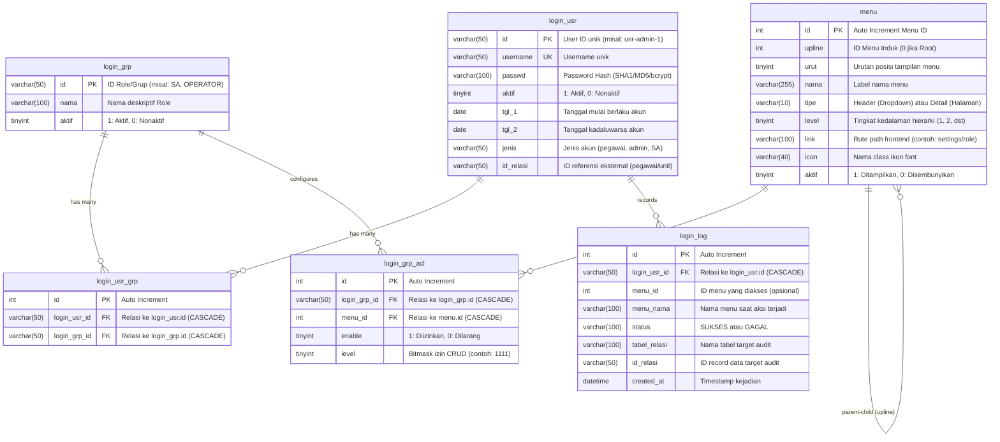

# Dokumentasi Backend Framework v1 (Core Auth & ACL)

Layanan backend ini dibangun menggunakan **Node.js**, **Express**, **TypeScript**, dan **Prisma ORM** dengan arsitektur **Clean Architecture (Hexagonal / DDD Pattern)**.

---

## 📁 1. Struktur Direktori & Keterangan Folder

```text
backend/
├── doc/                               # Folder dokumentasi teknis & arsitektur proyek
│   ├── README.md                      # Dokumentasi komprehensif backend & API
│   ├── BACKEND_OPERATION_UNIT_AND_KARYAWAN.md # Panduan teknis & spesifikasi endpoint OU & Karyawan
│   ├── PLAN_OPERATION_UNIT_AND_KARYAWAN.md    # Blueprint arsitektur hierarki OU & Karyawan
│   ├── POSTGRESQL_MIGRATION_GUIDE.md  # Panduan lengkap migrasi database ke PostgreSQL
│   ├── schema_postgres.sql            # Skrip DDL skema PostgreSQL siap pakai
│   └── data_export_postgres.sql       # Skrip DML data eksisting & sinkronisasi sequence
├── prisma/                            # Konfigurasi ORM & Database Schema
│   └── schema.prisma                  # Definisi model MySQL (login_usr, login_grp, menu, login_grp_acl, dll)
├── scripts/                           # Skrip utilitas & bantuan migrasi database legacy
│   ├── backup_and_migrate_menu.sql
│   └── migrate_instructions.md
├── src/
│   ├── domain/                        # Core Layer: Aturan bisnis murni & entitas domain (tanpa library luar)
│   │   ├── entities/                  # Objek data bisnis murni (Domain Entities)
│   │   │   ├── User.ts                # Entitas User & validasi status aktif akun (tgl1, tgl2, aktif)
│   │   │   ├── Menu.ts                # Entitas Menu
│   │   │   ├── Role.ts                # Entitas Role / Grup Otorisasi
│   │   │   └── LoginLog.ts            # Entitas Log Riwayat Aktivitas Login
│   │   └── repositories/              # Kontrak antarmuka (Repository Interfaces)
│   │       ├── IUserRepository.ts     # Kontrak manipulasi data User & Permissions
│   │       ├── IMenuRepository.ts     # Kontrak manipulasi data Menu & default ACL
│   │       ├── IRoleRepository.ts     # Kontrak manipulasi data Role
│   │       ├── IRoleAclRepository.ts  # Kontrak pemetaan matriks ACL Role & Menu
│   │       └── ILoginLogRepository.ts # Kontrak pencatatan log autentikasi
│   │
│   ├── application/                   # Application Layer: Alur kerja logika bisnis (Use Cases murni)
│   │   └── use-cases/
│   │       ├── LoginUseCase.ts        # Alur login: cek user, password legacy, akun aktif, permissions, JWT & audit log
│   │       ├── ManageMenuUseCase.ts   # Logika use-case CRUD data master menu & auto-assign ACL
│   │       ├── ManageRoleUseCase.ts   # Logika use-case CRUD grup/role pengguna
│   │       ├── ManageRoleAclUseCase.ts# Logika use-case konfigurasi matriks ACL & bitmask permission
│   │       └── GetUserMenusUseCase.ts # Logika bisnis penyusunan pohon hierarki menu user berizin
│   │
│   ├── infrastructure/                # Infrastructure Layer: Adapter driver DB & keamanan eksternal
│   │   ├── database/
│   │   │   ├── PrismaService.ts       # Singleton instance PrismaClient untuk koneksi MySQL
│   │   │   ├── seed.ts                # Seeder database inisial (user admin, role SA, menu awal)
│   │   │   └── repositories/          # Implementasi interface domain menggunakan Prisma Client
│   │   │       ├── PrismaUserRepository.ts
│   │   │       ├── PrismaMenuRepository.ts
│   │   │       ├── PrismaRoleRepository.ts
│   │   │       ├── PrismaRoleAclRepository.ts
│   │   │       └── PrismaLoginLogRepository.ts
│   │   └── security/
│   │       ├── JwtService.ts          # Service enkripsi / penandatanganan (sign) & verifikasi token JWT
│   │       └── LegacyHasher.ts        # Kompatibilitas verifikasi password hash legacy (SHA1, MD5, bcrypt)
│   │
│   └── presentation/                  # Delivery Layer: Routing HTTP, Controllers & Middleware
│       ├── controllers/               # Handler HTTP Express (hanya menerima request & mendelegasikan ke UseCase)
│       │   ├── AuthController.ts      # Delegasi ke LoginUseCase
│       │   ├── MenuController.ts      # Delegasi ke ManageMenuUseCase
│       │   ├── RoleController.ts      # Delegasi ke ManageRoleUseCase
│       │   ├── RoleAclController.ts   # Delegasi ke ManageRoleAclUseCase
│       │   └── UserMenuController.ts  # Delegasi ke GetUserMenusUseCase
│       ├── routes/                    # Modular Express Routers (Terpisah rapi per-modul)
│       │   ├── auth.routes.ts         # Routing /api/auth
│       │   ├── menu.routes.ts         # Routing /api/menus
│       │   ├── user-menu.routes.ts    # Routing /api/user/menus
│       │   ├── role.routes.ts         # Routing /api/roles & ACLs
│       │   ├── admin.routes.ts        # Routing /api/admin
│       │   └── index.ts               # Agregator master API router
│       ├── middlewares/
│       │   ├── AuthMiddleware.ts      # Middleware verifikasi keabsahan Bearer JWT token
│       │   ├── AclMiddleware.ts       # Middleware filter otorisasi level menu (C/R/U/D & Super Admin bypass)
│       │   └── ErrorHandlerMiddleware.ts # Global centralized error handling middleware
│       ├── swagger.ts                 # Konfigurasi OpenAPI 3.0 & Swagger UI
│       └── index.ts                   # Entry point aplikasi Express (Hanya bootstrap server & routing)
│
├── Dockerfile                         # Konfigurasi Docker container backend
├── package.json                       # Daftar dependensi & npm script
└── tsconfig.json                      # Konfigurasi compiler TypeScript
```

---

## 🚀 2. Fitur & Endpoint Backend yang Siap Dikonsumsi Frontend

Server backend berjalan di `http://localhost:5001`.
Semua endpoint terlindungi (*protected*) memerlukan HTTP Header:
```http
Authorization: Bearer <accessToken>
```

---

### A. Modul Autentikasi (`/api/auth`)
Digunakan oleh halaman Login dan Auth Context frontend:

#### 1. Login Pengguna
- **Method & Path**: `POST /api/auth/login` (Public)
- **Request Body**:
  ```json
  {
    "username": "admin",
    "password": "password123"
  }
  ```
- **Response Sukses (200 OK)**:
  ```json
  {
    "accessToken": "eyJhbGciOiJIUzI1NiIsInR5cCI6IkpXVCJ9..."
  }
  ```
- **Catatan**: Token JWT menyimpan payload:
  - `sub`: User ID
  - `username`: Nama pengguna
  - `jenis`: Jenis akun (`pegawai`, `admin`, `SA`)
  - `idRelasi`: ID relasi pegawai/unit
  - `permissions`: Array hak akses menu `[{ menuId: 1, enable: true, level: 4 }]`

#### 2. Profil Pengguna
- **Method & Path**: `GET /api/auth/profile` (Bearer Token)
- **Response Sukses (200 OK)**:
  ```json
  {
    "user": {
      "sub": "usr-admin-1",
      "username": "admin",
      "jenis": "pegawai",
      "idRelasi": "peg-1",
      "permissions": [
        { "menuId": 1, "enable": true, "level": 4 },
        { "menuId": 2, "enable": true, "level": 4 }
      ]
    }
  }
  ```

---

### B. Modul Navigasi Menu User (`/api/user/menus`)
Digunakan langsung oleh komponen navigasi **Sidebar**:

- **Method & Path**: `GET /api/user/menus` (Bearer Token)
- **Fungsi**: Mengembalikan struktur menu bertingkat (*tree structure*) yang **sudah difilter otomatis** sesuai hak akses user yang sedang login (atau seluruh menu jika user adalah super admin).
- **Format Response (200 OK)**:
  ```json
  [
    {
      "id": 1,
      "upline": 0,
      "urut": 1,
      "nama": "DASHBOARD UTAMA",
      "tipe": "Detail",
      "level": 1,
      "link": "/",
      "icon": "fa fa-dashboard",
      "aktif": 1,
      "submenus": []
    },
    {
      "id": 2,
      "upline": 0,
      "urut": 2,
      "nama": "PENGATURAN",
      "tipe": "Header",
      "level": 1,
      "link": "/",
      "icon": "fa fa-th",
      "aktif": 1,
      "submenus": [
        {
          "id": 3,
          "upline": 2,
          "urut": 1,
          "nama": "ROLE MANAGEMENT",
          "tipe": "Detail",
          "level": 2,
          "link": "settings/role",
          "icon": "fa fa-users",
          "aktif": 1,
          "submenus": []
        },
        {
          "id": 4,
          "upline": 2,
          "urut": 2,
          "nama": "SETUP MENU",
          "tipe": "Detail",
          "level": 2,
          "link": "settings/menu",
          "icon": "glyphicon glyphicon-file",
          "aktif": 1,
          "submenus": []
        }
      ]
    }
  ]
  ```

---

### C. Modul Manajemen Menu (`/api/menus`)
Digunakan oleh halaman `MenuListPage` dan `MenuFormPage`:

| Method | Endpoint | Hak Akses ACL | Keterangan |
| :--- | :--- | :---: | :--- |
| **GET** | `/api/menus` | Menu 2, Level 1 (Read) | Mengambil seluruh daftar master menu dalam format flat array |
| **GET** | `/api/menus/:id` | Menu 2, Level 1 (Read) | Mengambil detail menu berdasarkan ID (untuk form edit) |
| **POST** | `/api/menus` | Menu 2, Level 2 (Create) | Menambahkan menu baru |
| **PUT** | `/api/menus/:id` | Menu 2, Level 3 (Update) | Memperbarui data menu |
| **DELETE** | `/api/menus/:id` | Menu 2, Level 4 (Delete) | Menghapus menu |

#### Payload `POST` / `PUT` `/api/menus`:
```json
{
  "upline": 0,
  "urut": 1,
  "nama": "Manajemen Pengguna",
  "tipe": "Detail",
  "level": 1,
  "link": "/settings/users",
  "icon": "fa fa-users",
  "aktif": 1
}
```

---

### D. Modul Manajemen Role (`/api/roles`)
Digunakan oleh halaman `RoleListPage` dan `RoleFormPage`:

| Method | Endpoint | Hak Akses ACL | Keterangan |
| :--- | :--- | :---: | :--- |
| **GET** | `/api/roles` | Menu 3, Level 1 (Read) | Mendapatkan seluruh daftar role/grup otorisasi |
| **GET** | `/api/roles/:id` | Menu 3, Level 1 (Read) | Mendapatkan detail spesifik role berdasarkan ID (misal `/api/roles/SA`) |
| **POST** | `/api/roles` | Menu 3, Level 2 (Create) | Membuat role baru |
| **PUT** | `/api/roles/:id` | Menu 3, Level 3 (Update) | Mengupdate nama & status aktif role |
| **DELETE** | `/api/roles/:id` | Menu 3, Level 4 (Delete) | Menghapus role |

#### Payload `POST /api/roles`:
```json
{
  "id": "OPERATOR",
  "nama": "Operator Lapangan",
  "aktif": 1
}
```

---

### E. Modul Matriks Hak Akses Role / ACL (`/api/roles/:id/acls`)
Digunakan oleh tabel checklist izin (Create, Read, Update, Delete) per-menu pada form role:

| Method | Endpoint | Hak Akses ACL | Keterangan |
| :--- | :--- | :---: | :--- |
| **GET** | `/api/roles/:id/acls` | Menu 3, Level 1 (Read) | Mengambil seluruh menu dengan status aktif & level permission role tersebut |
| **GET** | `/api/roles/acls/template` | Menu 3, Level 1 (Read) | Template kosong untuk inisialisasi role baru yang belum punya ACL |
| **PUT** | `/api/roles/:id/acls` | Menu 3, Level 2 (Create/Edit) | Menyimpan pembaruan matriks konfigurasi ACL untuk role |

#### Struktur Response `GET /api/roles/:id/acls`:
```json
[
  {
    "id": 1,
    "upline": 0,
    "urut": 1,
    "nama": "DASHBOARD UTAMA",
    "tipe": "Detail",
    "level": 1,
    "acl": {
      "enable": 1,
      "level": 1111,
      "c": 1,
      "r": 1,
      "u": 1,
      "d": 1
    }
  }
]
```

#### Payload `PUT /api/roles/:id/acls`:
```json
[
  {
    "menuId": 1,
    "enable": 1,
    "level": 1111
  },
  {
    "menuId": 2,
    "enable": 1,
    "level": 1100
  }
]
```

---

### F. Endpoint Verifikasi Dashboard Admin (`/api/admin`)

- **Method & Path**: `GET /api/admin/dashboard` (Bearer Token, Menu 1, Level 1)
- **Fungsi**: Endpoint uji coba validasi verifikasi akses dashboard.
- **Response (200 OK)**:
  ```json
  {
    "message": "Selamat datang di dashboard admin! Hak akses Anda telah terverifikasi."
  }
  ```

---

### G. Modul Manajemen Pengguna & Role-User (`/api/users`)
Digunakan oleh modul **ROLE USER** (`/settings/roleuser`):

| Method | Endpoint | Hak Akses ACL | Keterangan |
| :--- | :--- | :---: | :--- |
| **GET** | `/api/users` | Menu 5, Level 1 (Read) | Mengambil seluruh daftar pengguna beserta array roles yang dimiliki |
| **GET** | `/api/users/:id` | Menu 5, Level 1 (Read) | Mengambil detail pengguna beserta roles |
| **POST** | `/api/users` | Menu 5, Level 2 (Create) | Membuat user baru (hashing password + alokasi roles awal) |
| **PUT** | `/api/users/:id` | Menu 5, Level 3 (Update) | Mengupdate data user (username, password, status, roles) |
| **DELETE** | `/api/users/:id` | Menu 5, Level 4 (Delete) | Menghapus user (cascades ke tabel relasi roles) |
| **GET** | `/api/users/:id/roles` | Menu 5, Level 1 (Read) | Mengambil daftar role yang dialokasikan untuk user |
| **PUT** | `/api/users/:id/roles` | Menu 5, Level 2 (Assign) | Menugaskan (*assign*) satu atau beberapa role ke user |

#### Payload `POST /api/users`:
```json
{
  "id": "usr-operator-1",
  "username": "operator",
  "password": "password123",
  "aktif": 1,
  "tgl1": "2026-01-01",
  "tgl2": "2035-12-31",
  "jenis": "pegawai",
  "idRelasi": "peg-1",
  "roleIds": ["SA", "OPERATOR"]
}
```

#### Payload `PUT /api/users/:id/roles`:
```json
{
  "roleIds": ["SA", "OPERATOR"]
}
```

#### Contoh Response `GET /api/users`:
```json
[
  {
    "id": "usr-admin-1",
    "username": "admin",
    "aktif": 1,
    "tgl1": "2026-01-01T00:00:00.000Z",
    "tgl2": "2030-12-31T00:00:00.000Z",
    "jenis": "pegawai",
    "idRelasi": "peg-1",
    "roles": [
      {
        "id": "SA",
        "nama": "SUPER ADMIN",
        "aktif": 1
      }
    ]
  }
]
```

---

## 📖 3. Dokumentasi Interaktif Swagger UI

Backend telah dilengkapi dengan **Swagger UI** (OpenAPI 3.0) yang dapat diakses langsung melalui peramban:

- **Swagger UI Interactive**: [http://localhost:5001/api-docs](http://localhost:5001/api-docs)
- **Spesifikasi JSON OpenAPI**: [http://localhost:5001/api-docs.json](http://localhost:5001/api-docs.json)
- **Uji Coba Autentikasi**:
  1. Jalankan `POST /api/auth/login` di Swagger UI untuk mendapatkan token.
  2. Klik tombol **Authorize** di kanan atas halaman Swagger.
  3. Masukkan token dan simpan.
  4. Semua endpoint terlindungi dapat langsung diuji coba dari browser.

---

## 🗄️ 4. Dokumentasi Basis Data & Relasi (Pedoman AI Agent & Pengembang)

Bagian ini dirancang khusus sebagai panduan teknis bagi **AI Agent** dan **Software Engineer** untuk memahami struktur data, relasi foreign key, dan logika bisnis inti yang terkait dengan database MySQL aplikasi ini.

### A. Diagram Relasi Entitas (ERD - Mermaid)



---

### B. Penjelasan Relasi Antar Tabel

1. **Many-to-Many: Pengguna & Role (`login_usr` ↔ `login_usr_grp` ↔ `login_grp`)**:
   - Satu pengguna dapat memiliki lebih dari satu Role/Grup.
   - Tabel pivot `login_usr_grp` menghubungkan `login_usr.id` dengan `login_grp.id`.
   - *Cascading*: Jika pengguna atau role dihapus, relasi pada tabel pivot otomatis terhapus (`onDelete: Cascade`).

2. **Many-to-Many: Role & Menu dengan Hak Akses (`login_grp` ↔ `login_grp_acl` ↔ `menu`)**:
   - Setiap grup/role dapat dikonfigurasikan hak aksesnya terhadap banyak menu.
   - Tabel pivot `login_grp_acl` menyimpan nilai `enable` (izin akses) dan `level` (tingkat CRUD).
   - *Cascading*: Jika menu atau role dihapus, entri ACL terkait otomatis dihapus.

3. **Hierarki Mandiri Rekursif Menu (`menu.upline` ➔ `menu.id`)**:
   - Kolom `menu.upline` mereferensikan `menu.id` dari menu induknya.
   - Menu tingkat utama (*Root Menu*) memiliki nilai `upline = 0` dan `level = 1`.
   - Submenu memiliki `upline = <id_parent>` dan `level = parent.level + 1`.
   - Backend memproses hierarki ini secara rekursif menjadi struktur JSON bersarang (*nested tree*) pada endpoint `/api/user/menus`.

4. **One-to-Many: Pengguna & Riwayat Audit (`login_usr` ➔ `login_log`)**:
   - Mencatat setiap upaya login (berhasil / gagal karena password salah / akun nonaktif).
   - *Cascading*: Jika pengguna dihapus, rekaman log aktivitas pengguna tersebut otomatis dihapus.

---

### C. Kamus Data Detail (Data Dictionary)

#### 1. Tabel `login_usr` (Data Pengguna)
| Kolom | Tipe Data MySQL | Constraints | Keterangan Bisnis |
| :--- | :--- | :--- | :--- |
| `id` | `VARCHAR(50)` | `PRIMARY KEY` | ID unik pengguna, misal: `usr-admin-1`. |
| `username` | `VARCHAR(50)` | `UNIQUE, NOT NULL` | Nama akun untuk autentikasi login. |
| `passwd` | `VARCHAR(100)` | `NOT NULL` | Hash password legacy (didukung via `LegacyHasher`). |
| `aktif` | `TINYINT` | `NOT NULL` | `1` = Aktif, `0` = Ditangguhkan/Nonaktif. |
| `tgl_1` | `DATE` | `NOT NULL` | Tanggal mulai berlakunya akun pengguna. |
| `tgl_2` | `DATE` | `NOT NULL` | Tanggal kadaluwarsa akun. |
| `jenis` | `VARCHAR(50)` | `NOT NULL` | Klasifikasi user: `SA` (Super Admin), `admin`, `pegawai`. |
| `id_relasi` | `VARCHAR(50)` | `NOT NULL` | ID referensi eksternal (misal: ID pegawai di sistem HR/ERP). |

#### 2. Tabel `login_grp` (Role & Grup Otorisasi)
| Kolom | Tipe Data MySQL | Constraints | Keterangan Bisnis |
| :--- | :--- | :--- | :--- |
| `id` | `VARCHAR(50)` | `PRIMARY KEY` | Kode unik role (contoh: `SA`, `OPERATOR`, `MANAGER`). |
| `nama` | `VARCHAR(100)` | `NOT NULL` | Nama deskriptif role (contoh: "Super Administrator"). |
| `aktif` | `TINYINT` | `NOT NULL` | `1` = Role aktif dan berlaku, `0` = Nonaktif. |

#### 3. Tabel `login_usr_grp` (Penetapan Role ke Pengguna)
| Kolom | Tipe Data MySQL | Constraints | Keterangan Bisnis |
| :--- | :--- | :--- | :--- |
| `id` | `INT` | `PRIMARY KEY, AUTO_INCREMENT` | ID baris relasi. |
| `login_usr_id` | `VARCHAR(50)` | `FK -> login_usr(id)` | Pengguna pemilik role. |
| `login_grp_id` | `VARCHAR(50)` | `FK -> login_grp(id)` | Role yang diberikan kepada pengguna. |

#### 4. Tabel `menu` (Struktur Menu Navigasi)
| Kolom | Tipe Data MySQL | Constraints | Keterangan Bisnis |
| :--- | :--- | :--- | :--- |
| `id` | `INT` | `PRIMARY KEY, AUTO_INCREMENT` | ID unik menu. |
| `upline` | `INT` | `NOT NULL` | ID menu induk (`0` jika merupakan root menu). |
| `urut` | `TINYINT` | `NOT NULL` | Nomor urut tampilan relatif terhadap upline yang sama. |
| `nama` | `VARCHAR(255)` | `NOT NULL` | Label menu yang tampil di antarmuka pengguna. |
| `tipe` | `VARCHAR(10)` | `NOT NULL` | `'Header'` (dropdown/grup) atau `'Detail'` (link halaman langsung). |
| `level` | `TINYINT` | `NOT NULL` | Kedalaman hierarki: `1` (Root), `2` (Submenu), dst. |
| `link` | `VARCHAR(100)` | `DEFAULT '#'` | Path URL rute frontend (contoh: `/`, `settings/role`). |
| `icon` | `VARCHAR(40)` | `DEFAULT 'glyphicon glyphicon-file'` | Nama kelas ikon untuk styling antarmuka. |
| `aktif` | `TINYINT` | `DEFAULT 1` | `1` = Menu aktif, `0` = Menu disembunyikan. |

#### 5. Tabel `login_grp_acl` (Matriks Izin Role terhadap Menu)
| Kolom | Tipe Data MySQL | Constraints | Keterangan Bisnis |
| :--- | :--- | :--- | :--- |
| `id` | `INT` | `PRIMARY KEY, AUTO_INCREMENT` | ID baris ACL. |
| `login_grp_id` | `VARCHAR(50)` | `FK -> login_grp(id)` | Role yang diatur izinnya. |
| `menu_id` | `INT` | `FK -> menu(id)` | Menu yang diberikan izin. |
| `enable` | `TINYINT` | `NOT NULL` | `1` = Izin aktif / menu dapat diakses, `0` = Akses ditutup. |
| `level` | `TINYINT` | `NOT NULL` | Nilai bitmask izin operasi CRUD (format desimal 4 digit). |

#### 6. Tabel `login_log` (Log Audit & Aktivitas Autentikasi)
| Kolom | Tipe Data MySQL | Constraints | Keterangan Bisnis |
| :--- | :--- | :--- | :--- |
| `id` | `INT` | `PRIMARY KEY, AUTO_INCREMENT` | ID entri log. |
| `login_usr_id` | `VARCHAR(50)` | `FK -> login_usr(id)` | Pengguna yang melakukan aktivitas. |
| `menu_id` | `INT` | `NULLABLE` | Menu yang diakses saat audit (jika ada). |
| `menu_nama` | `VARCHAR(100)` | `NULLABLE` | Nama menu saat audit. |
| `status` | `VARCHAR(100)` | `NOT NULL` | Status aktivitas (`SUKSES`, `GAGAL`, dll). |
| `tabel_relasi` | `VARCHAR(100)` | `NULLABLE` | Nama tabel yang dimodifikasi (untuk audit data). |
| `id_relasi` | `VARCHAR(50)` | `NULLABLE` | ID baris record yang dimodifikasi. |
| `created_at` | `DATETIME` | `DEFAULT NOW()` | Waktu timestamp pencatatan. |

---

### D. Logika Bisnis & Aturan Penting untuk Agent / Pengembang

Saat membaca atau memodifikasi backend, Agent harus mematuhi aturan logika bisnis berikut:

1. **Aturan Keabsahan Akun Pengguna (`User.isAccountActive()`)**:
   - Akun dianggap sah untuk login **hanya jika**:
     1. Kolom `aktif == 1`
     2. Tanggal sekarang berada di antara `tgl_1` dan `tgl_2` (`tgl_1 <= NOW() <= tgl_2`).

2. **Perhitungan Izin Gabungan (*Union Permissions*)**:
   - Jika pengguna terdaftar di beberapa grup pada `login_usr_grp`, hak akses ACL (`login_grp_acl`) dari seluruh grup tersebut digabungkan.
   - Jika salah satu grup memiliki `enable: 1`, pengguna berhak mengakses menu tersebut.
   - Level permission diambil dari nilai level tertinggi yang dimiliki grup-grup tersebut.

3. **Format Bitmask `level` pada ACL**:
   - Disimpan sebagai angka atau format desimal 4-digit yang merepresentasikan bit:
     - `c` (Create) = Digit ke-4 (ribuan, `1xxx`)
     - `r` (Read) = Digit ke-3 (ratusan, `x1xx`)
     - `u` (Update) = Digit ke-2 (puluhan, `xx1x`)
     - `d` (Delete) = Digit ke-1 (satuan, `xxx1`)
   - *Contoh*: Nilai `1111` berarti user memiliki izin penuh (Create, Read, Update, Delete). Nilai `100` (atau `0100`) berarti hanya berhak Read (Lihat data).
   - Pada middleware Express (`AclMiddleware(menuId, minLevel)`):
     - `minLevel: 1` ➔ Cukup memiliki hak Read.
     - `minLevel: 2` ➔ Memerlukan hak Create.
     - `minLevel: 3` ➔ Memerlukan hak Update.
     - `minLevel: 4` ➔ Memerlukan hak Delete.

4. **Bypass Hak Akses Super Admin**:
   - Pengguna dengan `jenis = 'SA'`, `jenis = 'admin'`, atau `username = 'admin'` memiliki hak akses istimewa (*superuser bypass*) yang melewati pemeriksaan tabel ACL dan otomatis mendapatkan akses penuh ke seluruh menu.

5. **Prisma Client Generation**:
   - Setiap kali file `prisma/schema.prisma` diperbarui, wajib menjalankan:
     ```bash
     npx prisma generate
     # Dan di dalam container Docker jika sedang berjalan:
     docker exec framework_backend npx prisma generate
     ```

